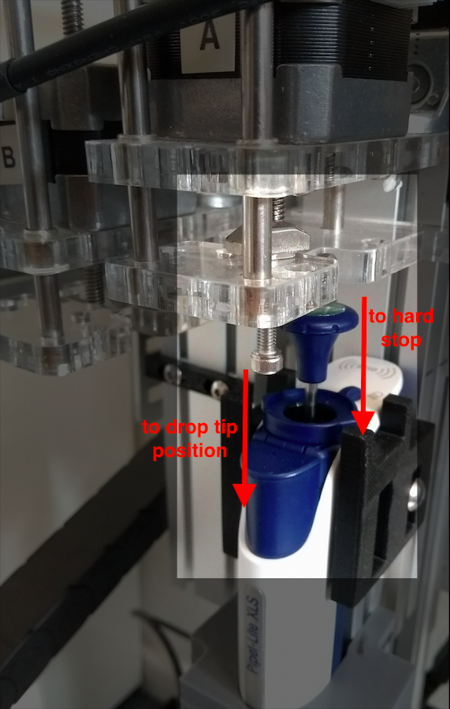

# Opentrons

This repository is aimed to be a guide for working with the OT-1 lab robot.

 *The OT-1 Lab robot*

The structure of the repository is as follows:
```
HARDWARE/
|
|--> drawings/
|--> stl files/
SOFTWARE/
|
|--> protocols/
media/
README.md
```
This README file explains how to set up the robot, how to create a protocol, how to calibrate the robot and finally how to run the protocol on the robot. The repository furthermore contains 3 folders with additional documentation: The `HARDWARE` folder contains technical drawings of the robot, furthermore, some stl files and drawings are dedicated to *firm labware attachment* which is indispensible for good calibration. The `SOFTWARE` folder contains example protocols, accompanied with diagrams to explain them. Additionaly a python notebook is included to illustrate how to create a protocol with jupyter notebooks. Finally, the `media` folder contains pictures and gifs used for this README file. 

## Overview
The following steps summarize how to write and test protocol code and subsequently upload it to the opentrons robot for running . (These will be explained more elaborately further on):

1. Write the code in jupyter notebook and test if it runs without errors. To be clear, at this point you are not running on the robot, you are simply simulating a run to see if the code doesn’t contain errors.
1. Once you designed the desired protocol and the code runs without errors, you transform the notebook to a python script 
1. Upload the python script to the Opentrons-One App
1. Calibrate the instruments on the deck of the opentrons robot (the pipette and the position of the tipracks, wells,...)
1. Run the protocol (by pressing the Run Job button in the Opentrons App)

If you want to run the same protocol again at a later time, repeat steps 3-5. One remark on recalibration (step 4): once you calibrate for a specific script, the app stores this calibration data, however it is good practice to check if all instruments still line up as expected.

## Before starting: Connect robot and install OT App.
First things first, before we start writing a protocol, let’s try to simply move the robot using the OT-1 App. First, we have to power and connect the robot. Plug the power cable into the power outlet and the usb cable into your laptop. Then press the power button.

 *Connect to the power outlet and plug the usb cable in your laptop. Press the power button.*

Secondly, download the Opentrons 1 App from the [opentrons site](https://opentrons.com/ot-app/). *Remark: Make sure you download the OT-1 and not the OT-2 app.
Opentrons made 2 lab robots: The opentrons 1 and the opentrons 2. Opentrons 1 was, it seems, intended to be the prototype of opentrons 2. So most documentation you find on the opentrons website is on OT-2.* 
When you open the app you get a screen that looks like this:

*The layout of the OT-1 App.*

You want to select the port that has a name similar to:
  */dev/tty.usbmodemFD121*
Then the app will suggest to home the robot. If you press ok, the robot will move to its home position.

If all went well, you can now play with the buttons and move the robot around. X,Y and Z coordinates are controlled through the Pipette Jog buttons. The Plunger Jog buttons are responsible for moving the pipette plunger following a system as shown in gif below:

 *Controlling the plunger.*

## Step 1: write protocol
We will consider a simple test code which uses an 8-channel 200 µl pipette to transfer 100 µl of liquid from the first to the second row of a 200 µl 96-wells plate.

*Illustration of the example protocol*

~~~

## Use the Opentrons API's containers and instruments
from opentrons import containers, instruments


## PART I: Add containers and pipettes:
# containers:
# Add a 96 well plate of 20 mm deep, and place it in slot 'C3'
plate = containers.load('96-well-plate-20mm', 'C3', 'plate')
# Add a 200uL tip rack, and place it in slot 'B3'
tiprack = containers.load('tiprack-200ul', 'B3','tiprack')

# pipettes:
# Add a 200uL 8 channel pipette to axis 'a', and tell it to use that tip rack
pipette = instruments.Pipette(
    axis='a',
    channels=8,
    max_volume=200, tip_racks=[tiprack])
    
    
## PART II: Specify protocol
# commands:
# Transfer 100uL from the plate's first row of wells to it's second row of wells.
pipette.transfer(100, plate.rows[0], plate.rows[1])

~~~

*Code of the example protocol*

### Testing in jupyter notebooks

To make sure you are using correct commands when writing the code, it is a good idea to use the opentrons python package and run the code in e.g. jupyter notebooks to see if you get any errors (the robot won’t work, but you can at least see if the code runs).

To install the package run:
~~~
>> pip install opentrons == 2.5.2
~~~
Once the package is installed you can start writing protocols. The example shown in Snippet 1 already contains the most important commands and the typical structure of a protocol:
* Adding the containers
* Adding the pipette(s)
* Specifying the commands

A good overview of the opentrons API (for OT1) can be found here: https://docs.opentrons.com/ot1/index.html. Taking a look at these pages is probably the easiest method to go a long way in writing protocols.

*Remark: When adding a container it is important to choose a container that has the exact right dimensions to avoid collisions with the robot. E.g. The '96-well-plate-20mm' is well specified because ‘96-well’ plates have standard well positions and the depth is in this case 20 mm. The dimensions of this plate correspond exactly to the dimensions of the physical plate used in the example.  A list of all built in containers can be found here: https://docs.opentrons.com/ot1/containers.html#labware-library. It is also possible to make your own custom containers.
* 

### Adding print commands
While testing the protocol you can add some print statements to get additional feedback on the code. A useful tool is the robot package from which you can print the robot commands. 

<pre>

<b>from opentrons import robot
robot.clear_commands()</b>

## Use the Opentrons API's containers and instruments
from opentrons import containers, instruments


## PART I: Add containers and pipettes:
# containers:
# Add a 96 well plate of 20 mm deep, and place it in slot 'C3'
plate = containers.load('96-well-plate-20mm', 'C3', 'plate')
# Add a 200uL tip rack, and place it in slot 'B3'
tiprack = containers.load('tiprack-200ul', 'B3','tiprack')

<b> print(plate,tiprack) </b>

# pipettes:
# Add a 200uL 8 channel pipette to axis 'a', and tell it to use that tip rack
pipette = instruments.Pipette(
    axis='a',
    channels=8,
    max_volume=200, tip_racks=[tiprack])
<b> print(pipette.max_volume)  </b>   
    
## PART II: Specify protocol
# commands:
# Transfer 100uL from the plate's first row of wells to it's second row of wells.
pipette.transfer(100, plate.rows[0], plate.rows[1])

<b> for c in robot.commands():
    print(c) </b>
</pre>
*Code of the example protocol with additional print statements (in bold)*

These print statements can be removed in the eventual protocol (the robot just ignores them when running the protocol) but are a good first check of your code.  For this code the output becomes:

~~~
<Container plate> <Container tiprack>
200
Picking up tip from <WellSeries: <Well A1><Well B1><Well C1><Well D1><Well E1><Well F1><Well G1><Well H1>>
Aspirating 100.0 at <WellSeries: <Well A1><Well B1><Well C1><Well D1><Well E1><Well F1><Well G1><Well H1>>
Dispensing 100.0 at <WellSeries: <Well A2><Well B2><Well C2><Well D2><Well E2><Well F2><Well G2><Well H2>>
Returning tip
Drop_tip at <WellSeries: <Well A1><Well B1><Well C1><Well D1><Well E1><Well F1><Well G1><Well H1>>
~~~
*Output of code with additional print statements using jupyter notebooks*

## Step 2: convert protocol to script
Once your protocol runs on jupyter notebooks, you make it into a python script. (I just paste it into a plain text document and add .py extension). The script has been uploaded in the folder `SOFTWARE/protocols/`

## Step 3: upload protocol
In the OT1 app you can now select the ‘Click to Upload’ button and upload your script to the app. The app will now identify the instruments you are using in the script and provide you with an interface to calibrate them. For this example you’ll have to calibrate the pipettes top, bottom, blowout and drop plunger positions and the positions of the tiprack and the 96 wells plate (see step 4). Of course this can only be done after attaching the pipette and placing the tiprack and 96-wells plate on the deck of the robot (see next section).

## Intermezzo: Don’t forget the hardware
### Place containers and instruments
Before we can calibrate, we must place the containers and attach the pipette. In this case, a Rainin 200 µl, 8 channel pipette (https://www.mt.com/us/en/home/products/pipettes/manual-pipettes/multichannel-pipettes.html) was used. To make sure the pipette is attached rigidly, a 3D printed holder was made (stl file in the `HARDWARE/` folder). The tiprack and 96-wells plate are also placed in such a way that they can not move. (More on the topic of efficiently placing labware can be found in the materials folder document: labware fixation methods) A rigid placement of the labware will save you a lot of time calibrating.

*Remark: The robot only knows about the instruments and containers declared in your script, so to make sure the robot isn’t going to collide, no unexpected objects should be on the deck.*


*the OT-1 robot with the containers and instruments on the right positions*

## Step 4: Calibration
### Pipette calibration
The pipette is attached to the robot. We now have to calibrate the plunger positions and the maximum volume so that the robot has the information to handle the pipette.
*Remark: I didn’t know a lot about pipettes so here is the very dry but useful explanation I found on youtube: https://www.youtube.com/watch?v=QGX490kuKjg*
Pipette calibration is explained pretty well on this webpage, but I do have some remarks (written down below):
https://support.opentrons.com/en/articles/689990-calibrating-the-pipettes

Some remarks on pipette calibration:
- I think the description for calibrating the pipettes top and bottom positions is good:
    - Top: plunger is positioned almost all the way up (but still being pressed down just a tiny bit)
    - Bottom: plunger is at or slightly above it’s “first-stop” or “soft-stop”

    However I would change it for blow out and drop positions:
    - Blow Out:  <s> plunger is all the way down to it's “second-stop” or “hard-stop”, making sure any attached tip do not get pushed off </s> --> plunger at the same position as bottom.
    - Drop Tip --> Forces any attached tip to fall off. This should coincide with the plunger being all the way down to its “second-stop” or “hard-stop. 

    The reason for these adjustments is that if you make ‘Blow Out’ coincide with the hard stop, any further movement of the motor will press the whole pipette down and it will cause strain and bending to the pipette and connecting parts. Since ‘Blow Out’ and ‘Bottom’ are now at the same position, there is no real blow out functionality anymore. *Remark: It makes sense because there is only one motor (read 1 degree of freedom) pressing down both the plunger and the ejector button.This should be fine however, to aspirate and dispense a specified amount of liquid, knowledge of top and bottom position is sufficient. Blow out is used to remove as much as possible of the remaining liquid in the tips (which normally is very little). Furthermore, when it is critical that the tips are completely clean it is maybe a better option to drop them and pick up a new set. (I learned this by talking to Taleen about pipettes, but if there are mistakes in this information then that’s highly likely me misinterpreting)*
- Related to the previous remark: To make sure the ‘Drop Tip’ position will coincide with the hard stop it is important to adjust the ejector screw such that it will press the ejector button hard enough for the tips to drop when the plunger is at the hard stop.

 *When the plunger moves to hard stop position, the screw simultaneously pushes the ejector button to reach ‘drop tip’ position.*

### Container calibration
The containers have now been placed on the robot deck. The dimensions of the containers are known and specified in the script. Now the only thing that remains is to determine their exact position. The position has to be specified perfectly to avoid collisions. This is done in the calibration process. 

Calibration of containers is very well explained on this webpage:
https://support.opentrons.com/en/articles/689977-calibrating-the-deck

## Step 5: Run the protocol
Press the Run Job button in the Opentrons App:
Gif or link to a speed up movie of the robot running the job


